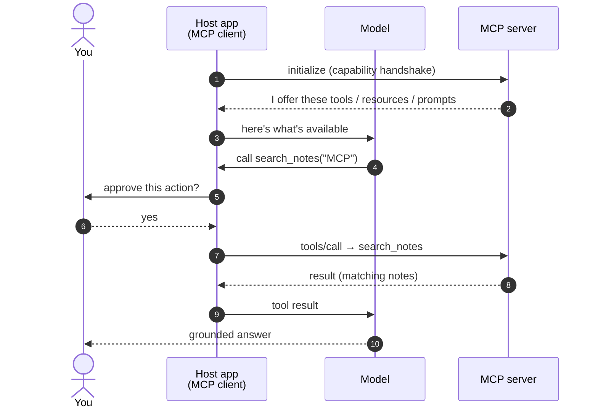

# How the Model Context Protocol (MCP) Works

> **TL;DR** — MCP is an open protocol (from Anthropic, November 2024) that gives AI
> applications **one standard way to plug into external tools and data**. Instead of
> building a custom integration for every app–data pair, you build one **MCP server**
> per data source, and every **MCP client** can use it. Think *USB-C for AI*: one port,
> many devices.

This is a visual explainer. If you're new, follow the diagrams top to bottom. If you've
shipped integrations before, jump to [Under the hood](#under-the-hood-for-the-experienced-reader).

---

## The problem it solves

Before MCP, every AI app that wanted your data needed its own bespoke connector. With
**N apps** and **M data sources**, you were on the hook for **N × M** integrations — and
every new tool multiplied the work.

MCP turns that multiplication into **addition**. Each app implements the client side
**once**; each data source gets **one** server. N × M becomes **N + M**.

=== "Before MCP — N × M"

    ```mermaid
    flowchart LR
        A1[🖥️ App 1]:::app
        A2[🖥️ App 2]:::app
        D1[(📁 Files)]:::src
        D2[(🐙 GitHub)]:::src
        D3[(🗄️ Database)]:::src
        A1 --- D1
        A1 --- D2
        A1 --- D3
        A2 --- D1
        A2 --- D2
        A2 --- D3
        classDef app fill:#2a0d14,stroke:#ff0a2f,color:#fff;
        classDef src fill:#15151b,stroke:#5a5a66,color:#ddd;
    ```

    Every line is a custom integration someone has to build and maintain.

=== "With MCP — N + M"

    ```mermaid
    flowchart LR
        A1[🖥️ App 1]:::app --> M{{🔌 MCP}}:::mcp
        A2[🖥️ App 2]:::app --> M
        M --> D1[(📁 Files)]:::src
        M --> D2[(🐙 GitHub)]:::src
        M --> D3[(🗄️ Database)]:::src
        classDef app fill:#2a0d14,stroke:#ff0a2f,color:#fff;
        classDef mcp fill:#ff0a2f,stroke:#ff0a2f,color:#fff;
        classDef src fill:#15151b,stroke:#5a5a66,color:#ddd;
    ```

    One protocol in the middle. Apps and sources only ever learn *it*, never each other.

---

## The big picture

A **host application** (Claude Desktop, an IDE, your own agent) embeds an **MCP client**.
That client opens a connection to one or more **MCP servers**. Each server wraps a real
data source or tool and exposes it through the same standard interface.

<figure markdown="span">
<div class="kh-diagram">
<svg viewBox="0 0 920 470" role="img" aria-label="MCP architecture: a host application containing an MCP client connects to multiple MCP servers, each wrapping a data source." style="width:100%;height:auto;font-family:-apple-system,Segoe UI,Roboto,sans-serif;">
  <defs>
    <marker id="ah" markerWidth="10" markerHeight="10" refX="7" refY="3" orient="auto"><path d="M0,0 L7,3 L0,6 Z" fill="#ff0a2f"/></marker>
    <marker id="ah2" markerWidth="10" markerHeight="10" refX="7" refY="3" orient="auto"><path d="M0,0 L7,3 L0,6 Z" fill="#5a5a66"/></marker>
  </defs>
  <rect x="1" y="1" width="918" height="468" rx="16" fill="#0e0e12" stroke="#2a2a33"/>
  <text x="32" y="40" fill="#ff0a2f" font-size="14" font-weight="700" letter-spacing="2">MCP ARCHITECTURE</text>

  <!-- column headers -->
  <text x="135" y="84" fill="#9C9CA6" font-size="12" letter-spacing="1.5" text-anchor="middle">HOST</text>
  <text x="455" y="84" fill="#9C9CA6" font-size="12" letter-spacing="1.5" text-anchor="middle">MCP SERVERS</text>
  <text x="800" y="84" fill="#9C9CA6" font-size="12" letter-spacing="1.5" text-anchor="middle">DATA &amp; TOOLS</text>

  <!-- HOST box -->
  <rect x="40" y="100" width="190" height="250" rx="14" fill="#15151b" stroke="#303039"/>
  <line x1="135" y1="120" x2="135" y2="132" stroke="#ff0a2f" stroke-width="2"/>
  <circle cx="135" cy="118" r="3" fill="#ff0a2f"/>
  <rect x="107" y="132" width="56" height="56" rx="12" fill="#2a0d14" stroke="#ff0a2f" stroke-width="1.5"/>
  <circle cx="124" cy="158" r="5" fill="#ff5d72"/>
  <circle cx="146" cy="158" r="5" fill="#ff5d72"/>
  <rect x="122" y="172" width="26" height="4" rx="2" fill="#ff5d72"/>
  <text x="135" y="212" fill="#ECECEE" font-size="14" font-weight="600" text-anchor="middle">AI application</text>
  <text x="135" y="230" fill="#9C9CA6" font-size="11" text-anchor="middle">the host</text>
  <rect x="62" y="286" width="146" height="46" rx="23" fill="#2a0d14" stroke="#ff0a2f" stroke-width="1.5"/>
  <text x="135" y="314" fill="#ff5d72" font-size="14" font-weight="700" text-anchor="middle">MCP Client</text>

  <!-- arrows client -> servers -->
  <path d="M210,300 C280,300 300,150 350,150" fill="none" stroke="#ff0a2f" stroke-width="2" marker-end="url(#ah)"/>
  <path d="M210,309 C290,309 300,240 350,240" fill="none" stroke="#ff0a2f" stroke-width="2" marker-end="url(#ah)"/>
  <path d="M210,318 C280,318 300,330 350,330" fill="none" stroke="#ff0a2f" stroke-width="2" marker-end="url(#ah)"/>
  <text x="288" y="196" fill="#9C9CA6" font-size="10" text-anchor="middle">stdio</text>
  <text x="300" y="262" fill="#9C9CA6" font-size="10" text-anchor="middle">HTTP</text>

  <!-- SERVER cards -->
  <!-- s1 -->
  <g transform="translate(350,120)">
    <rect x="0" y="0" width="240" height="60" rx="12" fill="#15151b" stroke="#303039"/>
    <rect x="14" y="12" width="36" height="36" rx="9" fill="#11301c" stroke="#2ea043"/>
    <rect x="22" y="20" width="20" height="5" rx="2" fill="#2ea043"/><rect x="22" y="28" width="20" height="5" rx="2" fill="#2ea043"/><rect x="22" y="36" width="20" height="5" rx="2" fill="#2ea043"/>
    <text x="62" y="27" fill="#ECECEE" font-size="14" font-weight="600">Filesystem server</text>
    <text x="62" y="45" fill="#9C9CA6" font-size="11">Resources · Tools</text>
  </g>
  <!-- s2 -->
  <g transform="translate(350,210)">
    <rect x="0" y="0" width="240" height="60" rx="12" fill="#15151b" stroke="#303039"/>
    <rect x="14" y="12" width="36" height="36" rx="9" fill="#241a36" stroke="#8957e5"/>
    <rect x="22" y="20" width="20" height="5" rx="2" fill="#8957e5"/><rect x="22" y="28" width="20" height="5" rx="2" fill="#8957e5"/><rect x="22" y="36" width="20" height="5" rx="2" fill="#8957e5"/>
    <text x="62" y="27" fill="#ECECEE" font-size="14" font-weight="600">GitHub server</text>
    <text x="62" y="45" fill="#9C9CA6" font-size="11">Tools · Resources</text>
  </g>
  <!-- s3 -->
  <g transform="translate(350,300)">
    <rect x="0" y="0" width="240" height="60" rx="12" fill="#15151b" stroke="#303039"/>
    <rect x="14" y="12" width="36" height="36" rx="9" fill="#13243d" stroke="#1f6feb"/>
    <rect x="22" y="20" width="20" height="5" rx="2" fill="#1f6feb"/><rect x="22" y="28" width="20" height="5" rx="2" fill="#1f6feb"/><rect x="22" y="36" width="20" height="5" rx="2" fill="#1f6feb"/>
    <text x="62" y="27" fill="#ECECEE" font-size="14" font-weight="600">Database server</text>
    <text x="62" y="45" fill="#9C9CA6" font-size="11">Tools</text>
  </g>

  <!-- server -> source arrows -->
  <path d="M590,150 L690,150" stroke="#5a5a66" stroke-width="2" marker-end="url(#ah2)"/>
  <path d="M590,240 L690,240" stroke="#5a5a66" stroke-width="2" marker-end="url(#ah2)"/>
  <path d="M590,330 L690,330" stroke="#5a5a66" stroke-width="2" marker-end="url(#ah2)"/>

  <!-- data sources -->
  <g transform="translate(700,126)">
    <path d="M4,10 h16 l5,6 h21 a4,4 0 0 1 4,4 v22 a4,4 0 0 1 -4,4 h-42 a4,4 0 0 1 -4,-4 v-28 a4,4 0 0 1 4,-4 z" fill="#11301c" stroke="#2ea043"/>
    <text x="58" y="33" fill="#C9C9CF" font-size="12">Local files</text>
  </g>
  <g transform="translate(700,216)">
    <circle cx="14" cy="16" r="6" fill="none" stroke="#8957e5" stroke-width="2"/>
    <circle cx="14" cy="40" r="6" fill="none" stroke="#8957e5" stroke-width="2"/>
    <circle cx="38" cy="28" r="6" fill="none" stroke="#8957e5" stroke-width="2"/>
    <path d="M14,22 v12 M14,28 h18 M32,28 a6,6 0 0 1 0,0" stroke="#8957e5" stroke-width="2" fill="none"/>
    <text x="58" y="33" fill="#C9C9CF" font-size="12">GitHub API</text>
  </g>
  <g transform="translate(700,306)">
    <ellipse cx="22" cy="14" rx="18" ry="6" fill="#13243d" stroke="#1f6feb"/>
    <path d="M4,14 v24 a18,6 0 0 0 36,0 v-24" fill="#13243d" stroke="#1f6feb"/>
    <path d="M4,26 a18,6 0 0 0 36,0" fill="none" stroke="#1f6feb"/>
    <text x="58" y="33" fill="#C9C9CF" font-size="12">SQL database</text>
  </g>

  <!-- flow legend -->
  <line x1="32" y1="392" x2="888" y2="392" stroke="#26262e"/>
  <g font-size="11.5" fill="#C9C9CF">
    <circle cx="44" cy="426" r="10" fill="#2a0d14" stroke="#ff0a2f"/><text x="44" y="430" fill="#ff5d72" font-size="11" font-weight="700" text-anchor="middle">1</text>
    <text x="60" y="430">Connect &amp; discover</text>
    <circle cx="214" cy="426" r="10" fill="#2a0d14" stroke="#ff0a2f"/><text x="214" y="430" fill="#ff5d72" font-size="11" font-weight="700" text-anchor="middle">2</text>
    <text x="230" y="430">Expose to model</text>
    <circle cx="372" cy="426" r="10" fill="#2a0d14" stroke="#ff0a2f"/><text x="372" y="430" fill="#ff5d72" font-size="11" font-weight="700" text-anchor="middle">3</text>
    <text x="388" y="430">Model requests</text>
    <circle cx="528" cy="426" r="10" fill="#2a0d14" stroke="#ff0a2f"/><text x="528" y="430" fill="#ff5d72" font-size="11" font-weight="700" text-anchor="middle">4</text>
    <text x="544" y="430">Client executes (you approve)</text>
    <circle cx="760" cy="426" r="10" fill="#2a0d14" stroke="#ff0a2f"/><text x="760" y="430" fill="#ff5d72" font-size="11" font-weight="700" text-anchor="middle">5</text>
    <text x="776" y="430">Result returns</text>
  </g>
</svg>
</div>
<figcaption><em>The host holds the client; the client speaks one protocol to many servers; each server wraps a real source. The model only ever asks — step 4 is where access actually happens.</em></figcaption>
</figure>

The key insight: **the model never touches your systems directly.** It sees a menu of
capabilities and emits structured requests. The host application executes them — usually
behind a user-approval prompt — and hands the result back.

---

## The three building blocks

Every MCP server can expose three kinds of things. Newcomers only really need to know
**Tools** at first; the other two round out the picture.

<div class="kh-diagram">
<svg viewBox="0 0 900 200" role="img" aria-label="The three MCP primitives: Tools, Resources, and Prompts." style="width:100%;height:auto;font-family:-apple-system,Segoe UI,Roboto,sans-serif;">
  <!-- Tools -->
  <rect x="8" y="20" width="280" height="160" rx="14" fill="#15151b" stroke="#303039"/>
  <rect x="32" y="44" width="48" height="48" rx="12" fill="#2a0d14" stroke="#ff0a2f"/>
  <circle cx="50" cy="62" r="7" fill="none" stroke="#ff5d72" stroke-width="3"/>
  <path d="M55,67 L70,82" stroke="#ff5d72" stroke-width="4" stroke-linecap="round"/>
  <text x="32" y="124" fill="#ECECEE" font-size="18" font-weight="700">Tools</text>
  <text x="32" y="150" fill="#9C9CA6" font-size="13">Functions the model can</text>
  <text x="32" y="168" fill="#9C9CA6" font-size="13">call: search, query, post.</text>

  <!-- Resources -->
  <rect x="310" y="20" width="280" height="160" rx="14" fill="#15151b" stroke="#303039"/>
  <rect x="334" y="44" width="48" height="48" rx="12" fill="#13243d" stroke="#1f6feb"/>
  <path d="M348,54 h16 l8,8 v22 h-24 z" fill="none" stroke="#6cb0ff" stroke-width="2.5"/>
  <text x="310" y="124" fill="#ECECEE" font-size="18" font-weight="700" dx="24"><tspan x="334">Resources</tspan></text>
  <text x="334" y="150" fill="#9C9CA6" font-size="13">Data the app can read</text>
  <text x="334" y="168" fill="#9C9CA6" font-size="13">into context: files, records.</text>

  <!-- Prompts -->
  <rect x="612" y="20" width="280" height="160" rx="14" fill="#15151b" stroke="#303039"/>
  <rect x="636" y="44" width="48" height="48" rx="12" fill="#11301c" stroke="#2ea043"/>
  <path d="M648,56 h24 a4,4 0 0 1 4,4 v12 a4,4 0 0 1 -4,4 h-12 l-8,8 v-8 h-4 a4,4 0 0 1 -4,-4 v-12 a4,4 0 0 1 4,-4 z" fill="none" stroke="#5fd17e" stroke-width="2.5"/>
  <text x="636" y="124" fill="#ECECEE" font-size="18" font-weight="700">Prompts</text>
  <text x="636" y="150" fill="#9C9CA6" font-size="13">Reusable, parameterized</text>
  <text x="636" y="168" fill="#9C9CA6" font-size="13">prompt templates.</text>
</svg>
</div>

| Primitive | Who initiates | Real example |
|-----------|---------------|--------------|
| **Tools** | The **model** asks to call it | `search_issues("login bug")` |
| **Resources** | The **application** reads it into context | a file, a database row, a doc |
| **Prompts** | The **user** picks one | "Summarize this PR" template |

---

## How a single request flows

Here's the full lifecycle of **one tool call** — connection handshake to final answer.
Note where the human sits (step 5): nothing executes without the client, and typically
not without you.



The model's entire involvement is *"I'd like to call `search_notes` with this argument."*
Everything with side effects — reaching the disk, the network, the database — happens on
the **client** side of that line.

---

## Transports: local vs remote

MCP runs the same messages over two transports, which cover the whole deployment spectrum:

- **stdio** — the server runs as a local process next to the client (great for files, git,
  local scripts). Fast, no network, no auth needed.
- **Streamable HTTP** — the server is remote (a hosted SaaS connector). Adds the usual
  network concerns: TLS, and increasingly OAuth for authorization.

Same protocol, same primitives — only the pipe changes.

---

## See it in code

A minimal tool server in Python (using the official SDK's `FastMCP`) is tiny:

```python
from mcp.server.fastmcp import FastMCP

mcp = FastMCP("notes")

@mcp.tool()
def search_notes(query: str) -> str:
    """Search my notes for a query string."""
    return do_search(query)  # your implementation

if __name__ == "__main__":
    mcp.run()  # stdio transport by default
```

Point Claude Desktop or an IDE at it and the `search_notes` tool simply *appears* — same
server, any MCP client, zero per-client work. That write-once property is the whole pitch.

---

## Under the hood (for the experienced reader)

A few things the diagrams gloss over:

- **Wire format is JSON-RPC 2.0.** Requests, responses, and notifications are JSON-RPC
  messages. Methods you'll see on the wire: `initialize`, `tools/list`, `tools/call`,
  `resources/list`, `resources/read`, `prompts/list`, `prompts/get`.
- **The handshake is capability negotiation.** `initialize` exchanges protocol version and
  declared capabilities, so client and server only use features both support — that's what
  lets the protocol evolve without breaking older peers.
- **Sampling inverts the arrow.** A server can ask the *client* to run a model completion
  on its behalf (`sampling/createMessage`). The client stays in control of model access and
  approval, which keeps cost and trust on the host side.
- **Resources can stream and update.** Servers can notify clients when a resource changes,
  so context can stay fresh rather than being a one-shot read.
- **Auth lives at the transport edge.** stdio inherits local trust; remote HTTP servers are
  where OAuth-style authorization and scopes matter. Treat a remote server like any third
  party with access to the underlying system.

The mental model that pays off: **MCP is plumbing, not intelligence.** It standardizes the
*connection layer*. Planning, tool-selection, and agent loops are built *on top* of it.

---

## Common misconceptions

- **"MCP gives the model access to my system."** No — the **client** holds all access and
  executes every request, normally behind user approval. The model only emits structured asks.
- **"MCP is an agent framework."** No — it's the connection standard. Agent logic sits above it.
- **"MCP is Anthropic-only."** It started at Anthropic, but the spec is open and has been
  adopted by other vendors, clients, and servers — which is what makes it a standard, not a feature.

---

*Related: [What is the Model Context Protocol (MCP)?](../what-is-mcp/) — the plain-text companion to this visual guide.*
