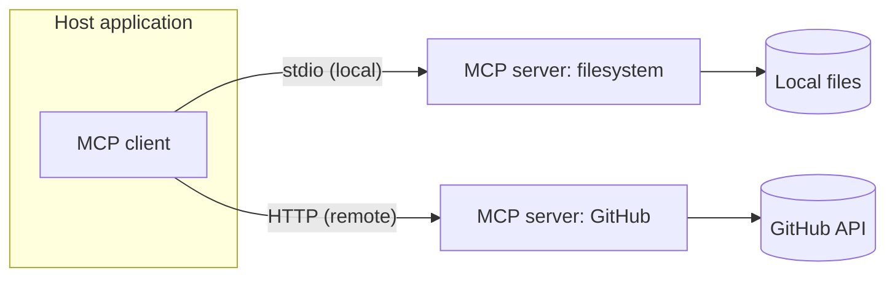

# What is the Model Context Protocol (MCP)?

> **TL;DR** — MCP is an open protocol, introduced by Anthropic in November 2024, that standardizes how AI applications connect to external data sources and tools. Instead of building a custom connector for every app–datasource pair, you build one MCP server and every MCP client can use it. Think USB-C for AI integrations.

## What it is

**Model Context Protocol** — an open protocol, introduced by Anthropic in November 2024, that standardizes how AI applications connect to external data sources and tools. An MCP *server* exposes resources, tools, and prompts; an MCP *client* (the AI application) consumes them. Think "USB-C for AI integrations": one protocol replaces N×M custom connectors.

A server exposes three kinds of things:

- **Tools** — functions the model can request to call (search an issue tracker, run a query).
- **Resources** — data the application can read into context (files, records, documents).
- **Prompts** — reusable, parameterized prompt templates.

Two transports cover the deployment spectrum: **stdio** for local servers running next to the client, and **HTTP** for remote ones.

## Why it matters

Before MCP, every AI application that wanted to reach your data needed its own integration. ChatGPT plugins were proprietary to one vendor; LangChain tools were locked to one framework. With N applications and M data sources, you were on the hook for N×M connectors.

MCP collapses that to N+M: each application implements the client side once, each data source gets one server. The protocol is open and has been adopted beyond Anthropic — which is what separates a standard from a feature.

## How it works



1. The host application connects to a server and asks what it offers (tools, resources, prompts).
2. Those capabilities are presented to the model as part of its context.
3. When the model wants something, it emits a structured request.
4. **The client application executes it** — typically after user approval — and returns the result to the model.

Step 4 carries the security model: the model never executes anything itself. It only asks.

## In practice

The SDKs (Python and TypeScript) make a minimal server small. A tool server in Python:

```python
from mcp.server.fastmcp import FastMCP

mcp = FastMCP("notes")

@mcp.tool()
def search_notes(query: str) -> str:
    """Search my notes for a query string."""
    return do_search(query)  # your implementation

if __name__ == "__main__":
    mcp.run()  # stdio transport by default
```

Point Claude Desktop or Claude Code at it and the tool appears — same server, both clients, zero per-client work. That write-once property is the whole pitch: I built a small server for my own notes and it works everywhere an MCP client exists. The community catalog (GitHub, Slack, Postgres, filesystem, and hundreds more) covers most common integrations already.

## Common misconceptions

- **"MCP gives the model access to my system."** No — the client application holds all access and executes every request, normally gated by user approval. The model emits structured asks, nothing more.
- **"MCP is an agent framework."** No — it's plumbing. It standardizes the connection layer; agent loops, planning, and orchestration are built on top of it, not inside it.
- **"MCP is Anthropic-only."** It started at Anthropic, but the spec is open and other vendors and tools have adopted client and server support.

---

*Notes for future revisions:* the auth story for remote HTTP servers (OAuth flow, client support) and the evolving registry/discovery picture deserve their own follow-up once researched.
