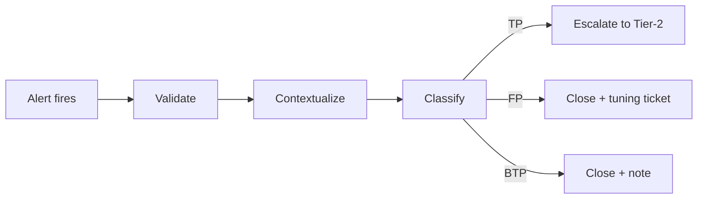

# Alert triage fundamentals for a Tier-1 SOC analyst

> **TL;DR** — Triage is deciding, fast, which alerts deserve a human hour. The loop is validate → contextualize → classify → escalate or close, and every close gets a note. Master the five context checks and the three classification buckets, and feed every false positive back into tuning — or you will see it again tomorrow.

## What it is

Alert triage is the Tier-1 analyst's core job: a SOC sees hundreds of alerts per shift, most of them benign, and triage is the disciplined process of separating the few that matter. It is not investigation — it is the gate in front of investigation.

The loop:



## Why it matters

Untriaged queues kill SOCs in both directions: real intrusions sit unread behind 400 scanner alerts, and analysts burn out closing the same false positive on autopilot. Triage discipline is the difference between a detection program and an expensive log archive.

## How it works

### 1. Validate

First question: is the detection logic even telling the truth? Pull the raw event behind the alert. A misparsed field or overbroad rule wastes everything downstream.

### 2. Contextualize — the five checks

| Context | Question | Why it changes the verdict |
|---------|----------|---------------------------|
| Asset criticality | Workstation or domain controller? | Same alert, different blast radius |
| User privilege | Intern or domain admin? | Privilege amplifies everything |
| Alert history | First time, or 50th this week? | Novelty is signal; repetition needs tuning |
| Threat intel | Are the IOCs known-bad? | Corroboration raises priority |
| Business context | Change window? Authorized scanner? | Most "attacks" are Tuesday |

Pivot around the alert in the SIEM — what else did that host and user do in a ±30 minute window:

```kql
DeviceEvents
| where DeviceName == "host-x"
| where Timestamp between (alert_time - 30min) .. (alert_time + 30min)
| order by Timestamp asc
```

### 3. Classify — three buckets, not two

- **TP (true positive)** — malicious activity. Escalate.
- **FP (false positive)** — detection fired wrongly. Close **with a tuning ticket**.
- **BTP (benign true positive)** — the detection worked, the behavior was real, and it was authorized (admin running a remote-exec tool). This is the bucket juniors miss; closing it as "FP" silently degrades tuning data.

ATT&CK mapping sharpens prioritization: a credential-dump alert on LSASS access (`T1003.001`) outranks a password spray (`T1110`) against an account that's already locked out.

### 4. Escalate or close

Tier-2 needs a handoff, not a hot potato: timeline of events, evidence collected, what you already ruled out, and your classification rationale. "Look at this" is not an escalation. And never close without a note — the note is what makes the 50th occurrence countable.

## In practice

Common traps:

- **Autopilot closes** — alert fatigue turns into muscle-memory dismissal; the real one dies in the queue.
- **Severity-field worship** — vendor severity is a default, not your risk. A "medium" on a crown-jewel asset beats a "critical" on a sandbox.
- **Closing duplicates without counting** — the count *is* the signal; 50 occurrences is either a tuning problem or a campaign.

Metrics that matter: time-to-triage P95 and per-rule FP rate. Raw closed-alert count rewards exactly the wrong behavior.

## Common misconceptions

- **"Triage is investigation."** No — triage decides whether investigation happens. Going deep on every alert is how queues die.
- **"FP rate is the SIEM team's problem."** The analyst closing the alert holds the evidence the tuning ticket needs. No ticket, no fix.
- **"More alerts closed = better analyst."** Throughput without classification quality is negative work.

---

*Notes for future revisions:*

- SOAR auto-triage: sensible confidence thresholds for auto-close vs. always-human review.
- Whether BTP volume per rule should feed a separate "authorize-list" workflow rather than tuning tickets.
